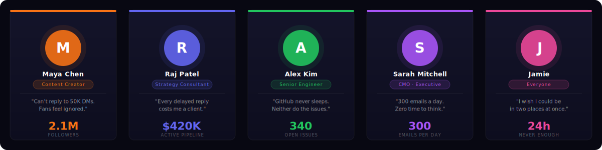

<div align="center">
<br/>


<br/>

[](https://github.com/VenkataAnilKumar/SELPH/actions/workflows/ci.yml)
[](https://github.com/VenkataAnilKumar/SELPH/releases/tag/v1.0.0-rc)
[](.)
[](.)
[](.)

<br/>

**[Live Demo →](DEMO.md)**&nbsp;&nbsp;&nbsp;**[Architecture →](docs/05-technical/SELPH_System-Architecture.md)**&nbsp;&nbsp;&nbsp;**[API →](docs/05-technical/SELPH_API-Design.md)**

<br/>

</div>

---

<br/>

## See It In Action



<br/>

## Who Is This For?



<br/>

## The Problem

Everyone is overwhelmed.

Creators can't reply to thousands of fans. Consultants repeat the same answers daily. Developers drown in issues and reviews. Executives can't keep up with email.

Generic AI helps with tasks. **It doesn't sound like you.**

<br/>

## The Idea

```
You record your voice. Your face. Your words. Your expertise.
                           ↓
                      SELPH becomes you.
                           ↓
        Message arrives → Twin drafts a reply in your voice
                           ↓
              You get a notification. Tap Approve.
                           ↓
        The other person hears you. Because it is you.
                           ↓
             SELPH learns. Gets better. Earns more trust.
```

<br/>

## What Makes It Different

**Twin Briefing** — Tell your twin something once. It knows it for every reply.
> *"I'm at a conference this week. Keep it short."*
> Every draft adjusts. Automatically.

<br/>

**VIP Tiers** — Your twin knows who matters.
> Co-founder messages bypass the twin entirely. Always.
> Investors get reviewed before anything sends. Always.

<br/>

**Batch Approval** — Creator scale, human touch.
> 50 fans asked the same question. One tap approves 50 personalized replies.
> You spent 4 seconds. They each feel seen.

<br/>

## Two Modes

| | Transparent | Private |
|---|---|---|
| What they see | *"Powered by SELPH — [Name]'s Digital Twin"* | Nothing. Looks like you. |
| Best for | Creators, public figures | Consultants, executives |
| Trust signal | Yes — builds credibility | Yes — seamless professionalism |

<br/>

## The Stack

| Layer | Technology |
|---|---|
| AI | LiteLLM · 140+ models · BYOK · Ollama local option |
| Orchestration | LangGraph — interruptible, human-in-the-loop |
| Voice | Chatterbox (open-source) · ElevenLabs (optional) |
| Avatar | Open-source MIT default · HeyGen (optional) |
| Backend | FastAPI · PostgreSQL + pgvector · async task queue |
| Apps | Next.js web · React Native mobile (iOS + Android) |
| Channels | Instagram DMs · Gmail · (more coming) |
| Compliance | GDPR · CCPA · EU AI Act · C2PA watermarking |

<br/>

## Safety — Non-Negotiable

- **You approve every draft.** Nothing sends without your tap.
- **VIPs bypass the twin.** Your closest relationships are never touched.
- **Hard blocks.** Financial, legal, medical actions are always off.
- **Full audit trail.** Every action logged, forever.
- **Pause in one tap.** Emergency stop on the home screen.

<br/>

## Get Started

```bash
git clone https://github.com/VenkataAnilKumar/selph.git
cd selph && cp .env.example .env
# Add your LLM API key
docker compose up --build
```

API live at `http://localhost:8000` · Docs at `http://localhost:8000/docs`

**[Full walkthrough with live API calls →](DEMO.md)**

<br/>

## Docs

[Product Vision](docs/01-product/PRODUCT_IDEA.md) · [PRD](docs/01-product/PRD.md) · [Architecture](docs/05-technical/SELPH_System-Architecture.md) · [API Design](docs/05-technical/SELPH_API-Design.md) · [Safety Policy](docs/04-safety/SELPH_Canonical-Policy-Matrix.md)

<br/>

## Contributing

Contributions are by invitation only. If you're on the core team, read **[CONTRIBUTING.md](CONTRIBUTING.md)** for branch naming, commit style, PR process, and code standards.

Found a bug? Open a GitHub Issue. Security vulnerabilities? Email `vanilkumarch@gmail.com` directly — do not open a public issue.

<br/>

## License

Copyright © 2026 Venkata Anil Kumar. All rights reserved.

Proprietary software — no part may be used, copied, modified, or distributed without express written permission. See **[LICENSE](LICENSE)** for full terms.

<br/>

---

<div align="center">

<br/>

*Be everywhere. Be SELPH.*

<br/>

*S · E · L · P · H — Self · Echo · Live · Proxy · Human*

<br/>

---

*Interested in the pilot or have questions?*
*Reach out → **[vanilkumarch@gmail.com](mailto:vanilkumarch@gmail.com)***

<br/>

</div>
